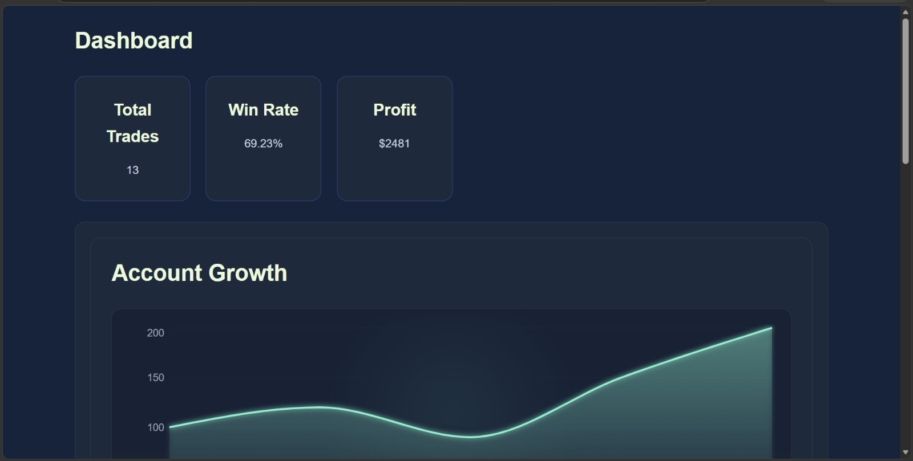
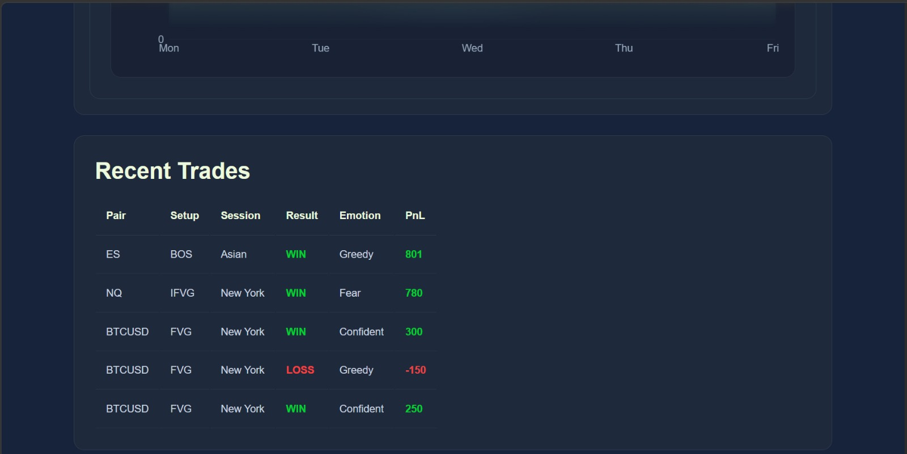
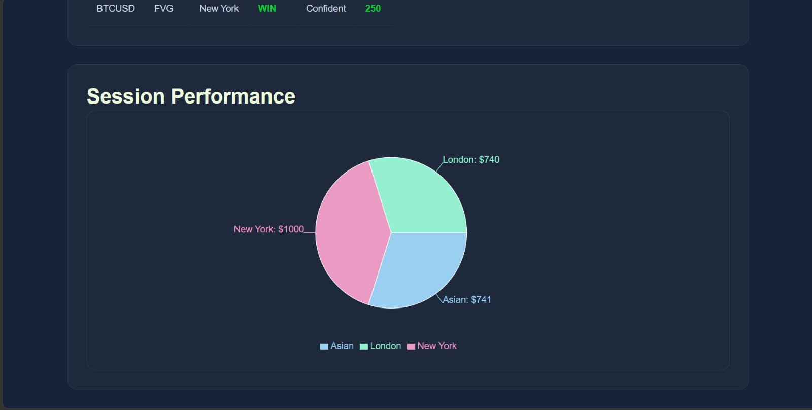
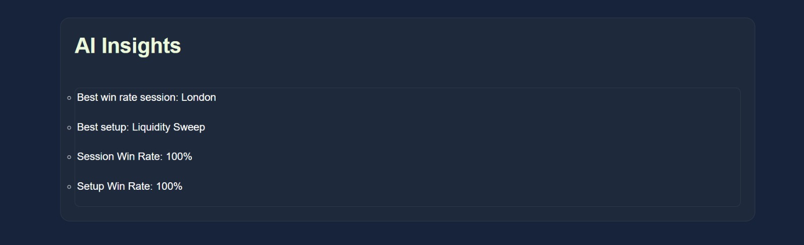
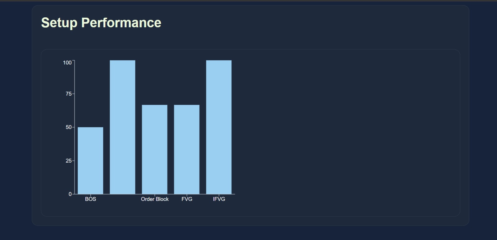
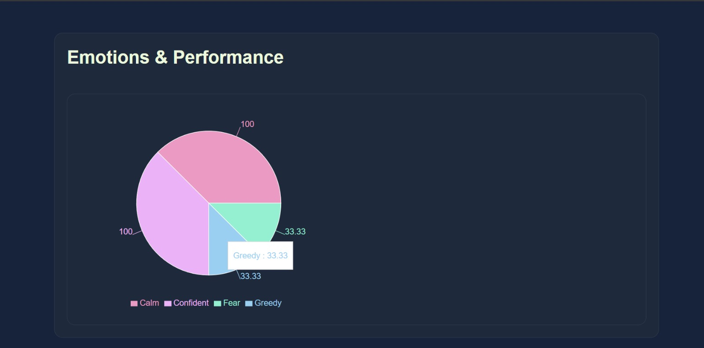
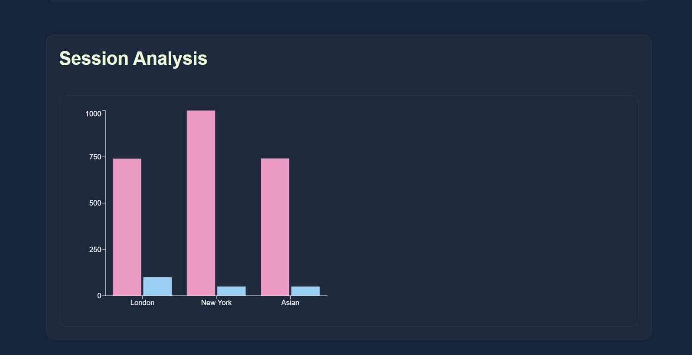
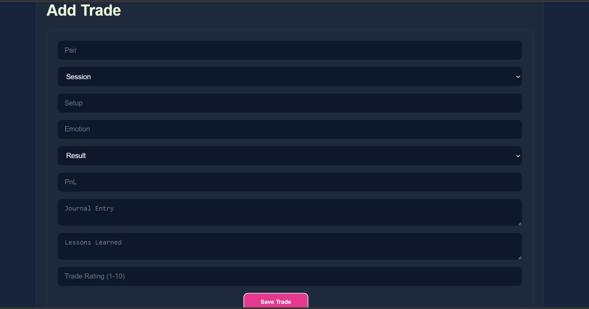
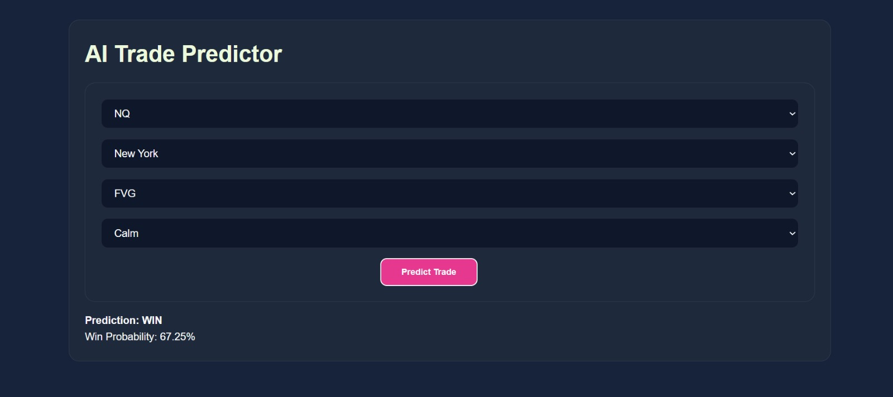

# 📈 AI Trading Journal

An AI-powered trading journal that helps traders analyze their trading performance, identify profitable patterns, and receive machine learning-based trade outcome predictions.

Built using FastAPI, PostgreSQL, SQLAlchemy, React, and Scikit-Learn.

---

## 🚀 Project Overview

Trading success depends heavily on discipline, data analysis, and pattern recognition.

Most traders record trades manually but struggle to extract actionable insights from their trading history.

AI Trading Journal solves this problem by:

- Recording and storing trade data
- Tracking performance metrics
- Analyzing trading behavior
- Visualizing trading statistics
- Predicting trade outcomes using Machine Learning

The platform acts as a personal trading analytics dashboard and AI assistant.

---

# 🏗️ System Architecture

```text
Frontend (React + Vite)
        │
        ▼
FastAPI Backend
        │
        ▼
PostgreSQL Database
        │
        ▼
Machine Learning Model
(Random Forest Classifier)
```

---

# ✨ Features

## 📊 Trading Dashboard

View overall trading performance:

- Total Trades
- Winning Trades
- Losing Trades
- Win Rate
- Total Profit/Loss
- Equity Curve

---

## ➕ Trade Journal

Record detailed trade information:

- Trading Pair
- Session
- Setup Type
- Emotion
- Result
- PnL

Example:

```json
{
  "pair": "BTCUSD",
  "setup": "Breakout",
  "session": "London",
  "emotion": "Confident",
  "result": "Win",
  "pnl": 150
}
```

---

## 🤖 AI Trade Prediction

Machine Learning model predicts probability of:

- Winning Trade
- Losing Trade

Input Features:

- Pair
- Session
- Setup
- Emotion

Model Used:

- Random Forest Classifier

Output:

```json
{
  "prediction": "Win",
  "confidence": 78.4
}
```

---

## 📈 Trading Analytics

Analyze performance based on:

### Pair Analysis

- BTCUSD
- EURUSD
- GBPUSD
- XAUUSD

Identify highest-performing instruments.

---

### Session Analysis

- London Session
- New York Session
- Asian Session

Determine which session produces best results.

---

### Setup Analysis

Evaluate performance of:

- Breakout
- Pullback
- Reversal
- Liquidity Sweep
- Order Block

---

### Emotion Analysis

Track emotional states:

- Confident
- Neutral
- Fearful
- Revenge Trading

Understand psychological impact on performance.

---

# 🧠 Machine Learning Pipeline

### Data Collection

Historical trades collected through trading journal.

### Data Preprocessing

- Pandas
- One-Hot Encoding
- Feature Engineering

### Model Training

Random Forest Classifier trained on historical trade data.

### Model Persistence

Saved using:

```python
joblib.dump(model, "random_forest_model.pkl")
```

Files:

```text
random_forest_model.pkl
model_columns.pkl
```

---

# ⚙️ Tech Stack

## Backend

- FastAPI
- SQLAlchemy
- PostgreSQL
- Pydantic
- Uvicorn

## Frontend

- React
- Vite
- JavaScript
- CSS

## Machine Learning

- Scikit-Learn
- Pandas
- NumPy
- Joblib

## Version Control

- Git
- GitHub

---

# 📂 Project Structure

```text
AI-Trading-Journal/
│
├── Backend/
│   │
│   ├── Database/
│   ├── Models/
│   ├── Routes/
│   │
│   ├── main.py
│   ├── database.py
│   ├── models.py
│   ├── requirements.txt
│   ├── random_forest_model.pkl
│   ├── model_columns.pkl
│   └── Trades.csv
│
├── Frontend/
│   │
│   ├── src/
│   ├── public/
│   ├── package.json
│   └── vite.config.js
│
├── .gitignore
└── README.md
```

---

# 🗄️ Database Design

### Trades Table

| Column | Type |
|----------|----------|
| id | Integer |
| pair | String |
| setup | String |
| session | String |
| emotion | String |
| result | String |
| pnl | Float |

---

# 🔌 API Endpoints

## Home

```http
GET /
```

Response:

```json
{
  "message": "AI Trading Journal API Running"
}
```

---

## Predict Trade Outcome

```http
POST /predict
```

---

## Add Trade

```http
POST /trades
```

---

## Get All Trades

```http
GET /trades
```

---

## Analytics

```http
GET /analytics
```

---

# 🖥️ Local Setup

## Clone Repository

```bash
git clone https://github.com/eklavya13/AI-Trading-Journal.git
```

---

## Backend Setup

```bash
cd Backend

python -m venv venv

venv\Scripts\activate

pip install -r requirements.txt
```

Run backend:

```bash
uvicorn main:app --reload
```

API Docs:

```text
http://127.0.0.1:8000/docs
```

---

## Frontend Setup

```bash
cd Frontend

npm install

npm run dev
```

Frontend:

```text
http://localhost:5173
```

---

# 🎯 Future Improvements

- JWT Authentication
- User Accounts
- Cloud Deployment
- Docker Support
- Real-Time Analytics
- Trade Screenshot Upload
- OCR Integration
- AI Trade Review Assistant
- Risk Management Dashboard
- Multi-User Support

---

## 📸 Screenshots

### Landing Page


### Dashboard





### Analytics






### Add Trade



### Prediction Result


---

# 📚 Learning Outcomes

This project helped me gain practical experience in:

- Machine Learning
- FastAPI Development
- PostgreSQL
- SQLAlchemy ORM
- REST API Design
- Frontend Integration
- Git & GitHub
- Full-Stack Development

---

# 👨‍💻 Author

**Eklavya Anand Singh**

B.Tech Computer Science & Engineering  
IIIT Bhubaneswar

GitHub:
https://github.com/eklavya13

---

## ⭐ Support

If you found this project useful, consider giving it a star on GitHub.
